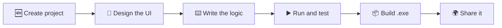

  

  # FlaxyIDE (before BetterDevelNext)

  ### Design it. Code it. Ship it.
  **A fast, friendly IDE for building Windows apps, powered by DevelNext and FXEdition.**

  
  
  
  

  [**Download**](#-get-flaxyide) · [**Features**](#-features) · [**How it works**](#-how-it-works) · [**Wishlist**](#-wishlist) · [**FAQ**](#-faq)

---
>[!Warning]
>Current build of this project is still having old name - BetterDevelNext, and old icon.
>
>It's the same project!

>[!Caution]
>This project is still moving to English language, IDE is currently support ~20% of English.
>
>That is not good, If you know only English language.
>
>Soo.. please, wait If you can.

## ✨ What is FlaxyIDE?

FlaxyIDE takes the proven DevelNext platform and turns it into a smoother, more modern place to build software. Drag components onto a canvas, write the logic next to them, and compile everything into a standalone `.exe` you can hand to anyone.

No heavyweight setup. No maze of menus. Whether you are writing your very first program or your fiftieth, FlaxyIDE keeps the path from idea to finished app short.

## 🚀 Features

| | |
|---|---|
| 🎨 **Visual designer** | Build interfaces by placing ready-made components instead of writing layout code by hand. |
| 🛠️ **Full coding toolkit** | Write, edit, and process code in one place with a rich set of developer tools. |
| 📚 **Huge standard library** | Lean on a wide range of built-in functions and classes so you write less boilerplate. |
| 📁 **Project manager** | Add, remove, rename, and reorganize files and folders without leaving the IDE. |
| 📦 **One-click builds** | Compile your project into a self-contained executable that is ready to distribute. |
| 🧭 **Modern interface** | A refreshed, intuitive UI designed for long, comfortable work sessions. |

## 🔄 How it works

1. **Create** a new project from the project manager.
2. **Design** your windows with the visual builder.
3. **Code** the behavior with the standard library at your side.
4. **Build** a standalone executable and send it to the world.

## 📥 Get FlaxyIDE

Always grab the latest release for the most stable and optimized experience.

### 👉 [Download the latest version (.exe)](https://github.com/timinside/BetterDevelNext/releases/latest/download/BetterDevelNextSetup.exe)

### Installation in 4 steps

1. Download the installer using the link above.
2. Run `BetterDevelNextSetup.exe`.
3. Follow the on-screen instructions. The installer will offer to install **bbruntime**, which FlaxyIDE needs to run correctly (skipped automatically if you already have it).
4. Wait for the installation to finish and launch the program.

<!--
## 🖼️ Screenshots
Add screenshots of the editor, the visual designer, and a built app here.
-->

## 💡 Wishlist

FlaxyIDE is shaped by the people who use it. Here is what is on the radar, and where you can add your own ideas.

### On the radar

- [ ]  Theme switcher with light, dark, and custom color schemes
- [ ]  Smarter code autocompletion and inline error hints
- [ ]  Plugin system for community extensions
- [ ]  Project templates for common application types
- [ ]  Built-in Git support (commit, push, pull, diff)
- [ ]  Full English language support
- [ ]  Built-in documentation and quick-reference panel
- [ ]  Adding own GitHub-like system (public projects)
- [ ]  Creating own forum
- [ ]  Adding Python projects
- [ ]  Adding Web projects
- [ ]  More Project Settings to make it more simple

### Make a wish

1. Open the [Issues](https://github.com/timinside/BetterDevelNext/issues) tab.
2. Click **New issue** and label it as a **feature request**.
3. Tell us what problem it solves and how you picture it working.
4. Give existing requests a 👍 to help decide what comes next.

## ❓ FAQ

<b>Is FlaxyIDE good for beginners?</b>

Yes. The visual designer and the built-in library let you get a working app on screen quickly, and the same tools scale up to larger projects.

<b>What is bbruntime and why does the installer ask for it?</b>

It is a runtime component that FlaxyIDE needs in order to work properly. The installer offers to set it up for you if it is missing.

<b>Can I share the programs I build?</b>

Yes. Projects compile into a standalone executable, so you can distribute them without asking people to install your source or the IDE.

<b>I found a bug. Where do I report it?</b>

Open an issue in the [Issues](https://github.com/timinside/BetterDevelNext/issues) tab with a short description and steps to reproduce.

## 🙏 Credits

Built on top of **DevelNext** and **FXEdition**. Thanks to everyone behind those projects.

---

  Made with ❤️ by <a href="https://github.com/timinside">bbzer0</a>

